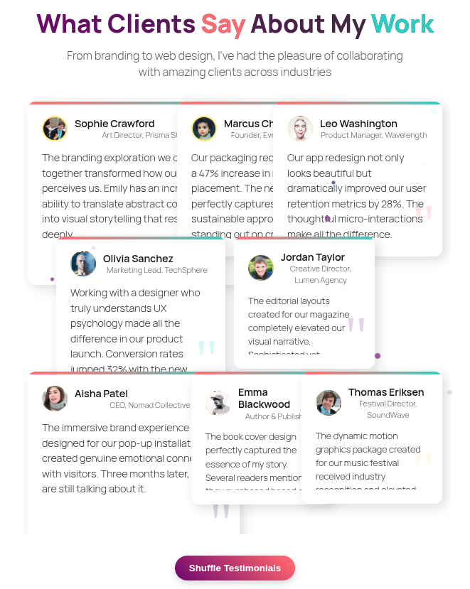
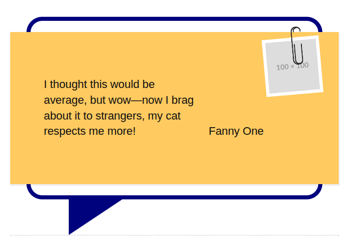
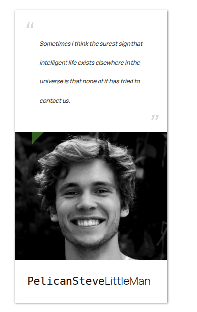
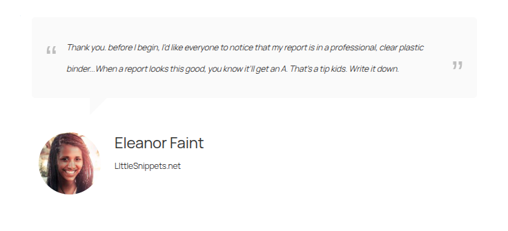

## Description

This WordPress plugin introduces well-crafted and fully customizable testimonials addons for the [WPBakery Page Builder](https://wpbakery.com/). All addons support both the front-end and back-end WPBakery editors. 

The WPBakery Page Builder plugin must be installed and activated to use this plugin. Once the required plugins are activated, the elements will be available for use in any WPBakery editor.

If you want to showcase customer feedback, client reviews, or user testimonials in a visually appealing and organized way, this plugin provides a variety of addons to help you build trust and highlight social proof on your website.

The WPBakery Page Builder plugin must be installed and activated to use this plugin. Once the required plugins are activated, the elements will be available for use in any WPBakery editor.

### 1. Interactive Shuffling Testimonials.

### 2. Sticker Testimonial.

### 3. Testimonial Card With Image.

### 4. Testimonial Profile Card Slider.

### 5. Testimonial Quote With Avatar.

## Installation
You can directly install the plugin from the GitHub repository.
1. Clone the repository to the `/wp-content/plugins/` directory.
2. Activate the plugin through the 'Plugins' menu in WordPress.

That's it! If you go to any WPBakery Page Builder editor, you'll find new elements under the 'JoyWP' tab in the 'Add Element' WPBakery popup.

## Requirements
1. WPBakery Page Builder version 5.0+
2. PHP version 7.4+
3. Wordpress version 4.9+
   
## Default Browser support
1. Chrome version 49+
2. Safari 12+
3. Firefox 78+
4. Edge: Chromium-based Edge (79+)

Please note that some elements use brand-new CSS/JS features, and browser support for them may vary. We specify browser support for such elements individually in the element edit window.
